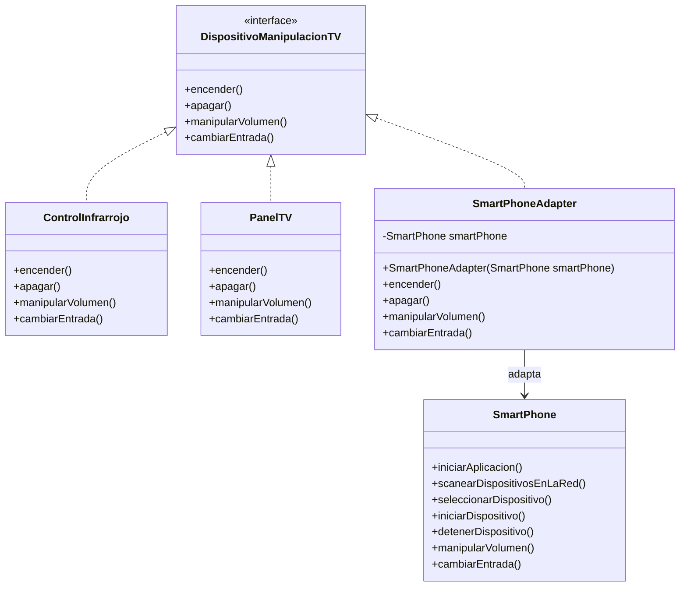

# Java-Ejemplo-Patrones

Ejercicio educativo de Java puro para explicar Programacion Orientada a Objetos y el patron de diseno **Adapter** de forma simple.

## Descripcion del problema

El sistema modela dispositivos que permiten manipular un televisor. Inicialmente existen dos dispositivos que funcionan bien con una misma abstraccion:

- `ControlInfrarrojo`
- `PanelTV`

Ambos pueden:

- Encender el televisor.
- Apagar el televisor.
- Manipular el volumen.
- Cambiar la entrada.

Luego se requiere agregar un `SmartPhone`. El smartphone tambien puede realizar esas acciones, pero internamente funciona de otra manera porque necesita abrir una aplicacion, buscar dispositivos en la red WiFi y seleccionar el televisor antes de enviar una orden.

Por esa diferencia, `SmartPhone` no debe heredar ni implementar directamente `DispositivoManipulacionTV`.

## Patron Adapter

El patron **Adapter** permite que una clase con una interfaz diferente pueda ser usada por un sistema que espera otra interfaz.

En este ejercicio:

- El sistema espera objetos de tipo `DispositivoManipulacionTV`.
- `SmartPhone` tiene metodos propios y una secuencia de uso distinta.
- `SmartPhoneAdapter` implementa `DispositivoManipulacionTV`.
- `SmartPhoneAdapter` recibe un `SmartPhone` y delega en el sus operaciones reales.

## Por que SmartPhone no hereda directamente

`SmartPhone` no representa naturalmente un dispositivo tradicional de manipulacion de TV. Sus pasos internos son diferentes:

1. Iniciar aplicacion.
2. Scanear dispositivos en la red.
3. Seleccionar dispositivo.
4. Ejecutar la accion solicitada.

Forzarlo a heredar o implementar directamente `DispositivoManipulacionTV` mezclaria responsabilidades y ocultaria el problema real. El adaptador mantiene limpia la clase `SmartPhone` y permite integrarla sin modificar las clases existentes.

## Solucion propuesta

La solucion mantiene el contrato existente `DispositivoManipulacionTV` para los dispositivos tradicionales. Luego se agrega una clase adaptadora:

- `ControlInfrarrojo` implementa `DispositivoManipulacionTV`.
- `PanelTV` implementa `DispositivoManipulacionTV`.
- `SmartPhone` conserva sus propios metodos.
- `SmartPhoneAdapter` implementa `DispositivoManipulacionTV` y usa composicion para recibir un `SmartPhone`.
- `Main` demuestra que los tres dispositivos se pueden usar polimorficamente desde una misma lista.

## Estructura del proyecto

```text
src/
└── main/
    └── java/
        └── com/
            └── ejemplo/
                └── televisor/
                    ├── Main.java
                    ├── adaptador/
                    │   └── SmartPhoneAdapter.java
                    ├── dispositivo/
                    │   ├── ControlInfrarrojo.java
                    │   ├── DispositivoManipulacionTV.java
                    │   └── PanelTV.java
                    └── smartphone/
                        └── SmartPhone.java
```

## Diagrama de clases



## Explicacion de las clases

- `DispositivoManipulacionTV`: interfaz que define las operaciones comunes para manipular un televisor.
- `ControlInfrarrojo`: dispositivo tradicional que implementa directamente las operaciones del contrato.
- `PanelTV`: panel fisico del televisor que implementa las mismas operaciones.
- `SmartPhone`: clase independiente con metodos propios para operar mediante aplicacion y WiFi.
- `SmartPhoneAdapter`: adaptador que permite usar un `SmartPhone` como si fuera un `DispositivoManipulacionTV`.
- `Main`: clase de demostracion que recorre una lista de dispositivos y ejecuta las mismas operaciones en todos.

## Conceptos POO aplicados

- Abstraccion: `DispositivoManipulacionTV` define que debe hacer un dispositivo, sin imponer como lo hace.
- Herencia o implementacion: `ControlInfrarrojo`, `PanelTV` y `SmartPhoneAdapter` implementan el mismo contrato.
- Polimorfismo: `Main` usa una lista de `DispositivoManipulacionTV` para tratar todos los dispositivos de la misma forma.
- Encapsulamiento: `SmartPhoneAdapter` mantiene privado el `SmartPhone` que adapta.
- Composicion: `SmartPhoneAdapter` contiene un `SmartPhone` y delega trabajo en el.

## Compilar y ejecutar en IntelliJ IDEA

1. Abrir IntelliJ IDEA.
2. Seleccionar `File > Open`.
3. Elegir la carpeta del proyecto.
4. Configurar un SDK de Java 17 o superior.
5. Abrir la clase `src/main/java/com/ejemplo/televisor/Main.java`.
6. Ejecutar el metodo `main` con el boton verde de IntelliJ.

## Compilar y ejecutar por consola

Desde la raiz del proyecto:

```bat
mkdir build\classes
dir /s /b src\main\java\*.java > fuentes.txt
javac -encoding UTF-8 -d build\classes @fuentes.txt
java -cp build\classes com.ejemplo.televisor.Main
del fuentes.txt
```

## Ejemplo esperado de salida

```text
========================================
Dispositivo: ControlInfrarrojo
========================================
Control infrarrojo: enviando senal para encender el televisor.
Control infrarrojo: ajustando el volumen con botones fisicos.
Control infrarrojo: cambiando la entrada del televisor.
Control infrarrojo: enviando senal para apagar el televisor.

========================================
Dispositivo: PanelTV
========================================
Panel TV: encendiendo el televisor desde el boton del panel.
Panel TV: ajustando el volumen desde el panel frontal.
Panel TV: cambiando la entrada desde el panel del televisor.
Panel TV: apagando el televisor desde el boton del panel.

========================================
Dispositivo: SmartPhoneAdapter
========================================
SmartPhone: iniciando la aplicacion de control remoto.
SmartPhone: scaneando dispositivos disponibles en la red WiFi.
SmartPhone: seleccionando el televisor encontrado.
SmartPhone: enviando orden para iniciar el televisor.
...
```

## Notas tecnicas

- Java puro.
- Sin Spring Boot.
- Sin frameworks externos.
- Sin base de datos.
- Sin Maven ni Gradle.
